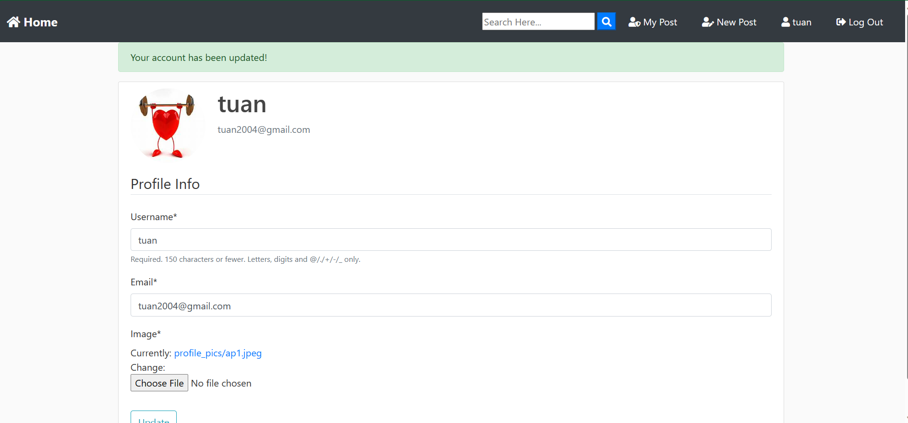
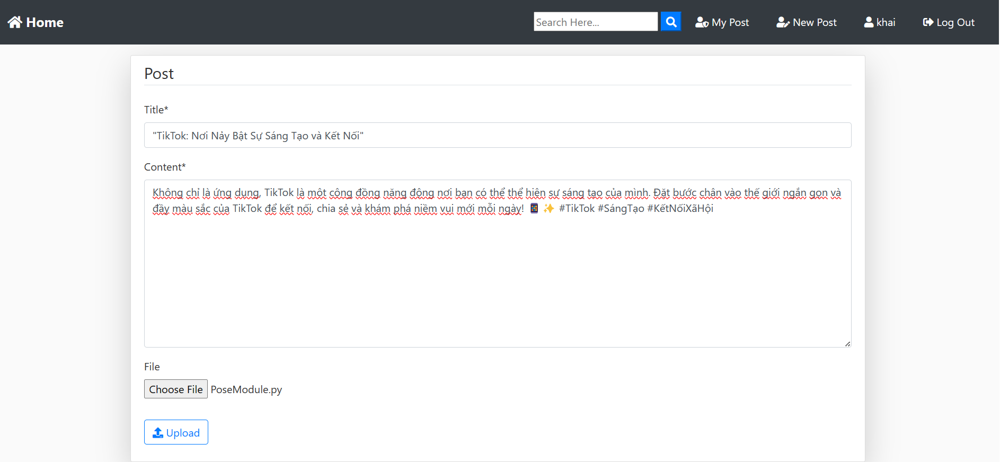
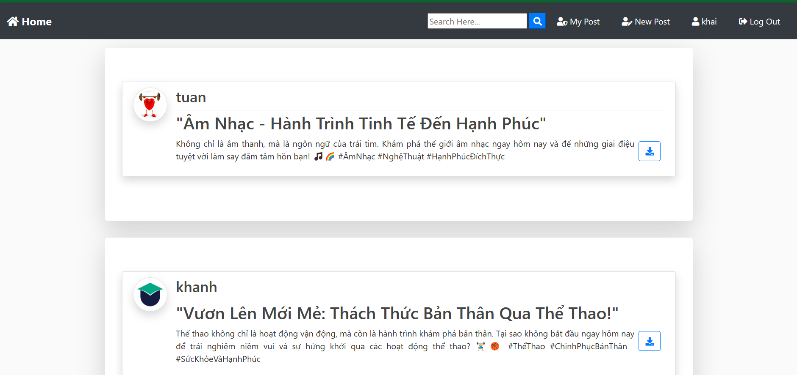
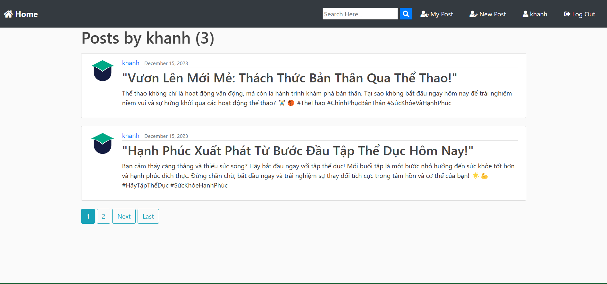
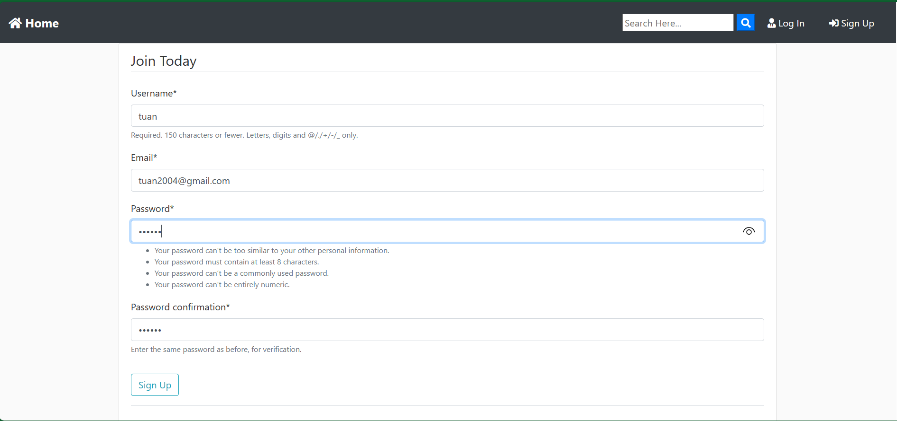
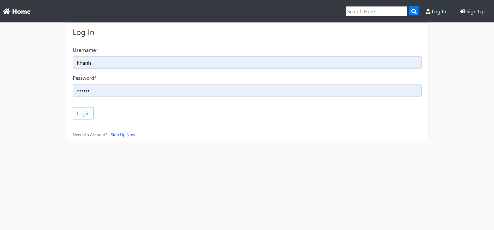

# Django Web Face
## By Chau The Khanh 


## Features

<h4>Part 1:</h4>
<ol>
    <li>Create a web-app where a user can login and logout.</li>
    <li>User can upload files.</li>
    <li>User can view his/her uploaded files.</li>
</ol>

<h4>Part 2:</h4>
<ol>
     <li>User can search and view profile of other users.</li>
     <li>They can share their uploaded files with any of those users.</li>
     <li>Users can also view files shared by other users in uploaded files.</li>
</ol>

<h4>Part 3:</h4>
<h5>Admin</h5>
<ol>
    <li>There is only one admin</li>
    <li>Viewing the status of accounts.</li>
    <li>The server can delete posts from anyone.</li>
    <li>The server can update the profile of anyone.</li>
    
</ol>

<h4>Additional Features:</h4>
<ol>
    <li>In users profile user can set his/her profile picture.</li>
    <li>Users can download other users uploaded files.</li>
    <li>The user can upload any type of files such as images, videos, text files (exe, txt, ...) and also different types of programs like python code, java code, etc.</li>
</ol>
    
## Technologies Used:
<ul>
    <li>Python 3.8</li>
    <li>Django 4.2</li>
    <li>Bootstrap</li>
    <li>JavaScript</li>
</ul>
    
## Additional Python Modules Required:
<ul>
    <li>django-crispy-forms 2.1</li>
    <li>crispy-bootstrap4 2023.1</li>
    <li>Pillow 10.1.0</li>
</ul>
  

<h2>Usage :</h2>

    python DjangoWebFace/manage.py makemigrations

    python DjangoWebFace/manage.py migrate

    python DjangoWebFace/manage.py runserver
    
   In your web browser enter the address : http://localhost:8080 or http://127.0.0.1:8080/


## I. Install basic things
### 1. Setup new Django project
- Let’s create a new Django project with command:
```bash
django-admin startproject DjangoWebFace
```

### 2. Setup new Django app for blog
- Run following commands to create new Django app tutorials:
```bash
cd DjangoWebFace
python manage.py startapp blog
```

### 3. Migrate Data Model to the database
- Run the Python script:
```bash
cd DjangoWebFace
python manage.py makemigrations blog
```
- To apply the generated migration above, run the following Python script:
```bash
python manage.py migrate blog
```

### 4. Run

```bash
python manage.py runserver 8080
```
It starts development server at `http://127.0.0.1:8080/` or `http://localhost:8080/`.

## II. Advanced setup
### 1. Setup new Django app for users
```bash
cd DjangoWebFace
python manage.py startapp users
```

### 2. Create user admin
Run the Python script: ```python manage.py createsuperuser```
```bash
Username (leave blank to use 'your_computer_username'): your_name_user
Email address: xxxx@gmail.com
Password: ******
Password (again): ******
```

### 3. Update Database
Run the Python script: ```python manage.py shell```

Importing a library: 
```bash
from django.contrib.auth.models import User
from blog.models import Post  
```

Display all users in the database:
```bash
all_users = User.objects.all()
print(all_users)
```

Display all posts in the database:
```bash
all_posts = Post.objects.all()
print(all_posts)
```

Find or create a new user:
```bash
user, created = User.objects.get_or_create(username='your_username', defaults={'password': 'your_password'})
print(f"User created: {created}")
```

Create a new record:
```bash
post = Post(
    title='Your Post Title',
    file='path/to/your/file.txt',
    content='Your post content.',
    author=user
)
```

Save the record to the database: ```bash post.save()```

Display all users and posts after adding:
```bash
print(User.objects.all())
print(Post.objects.all())
```
## III. Deloy

Link Demo: https://khanhchau567.pythonanywhere.com/

## IV. Screenshots : 





